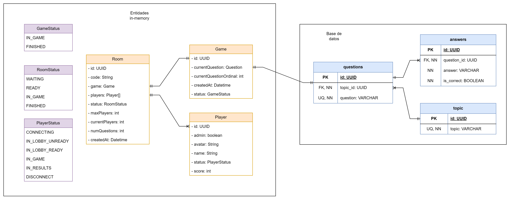
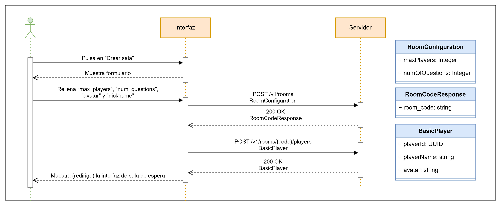
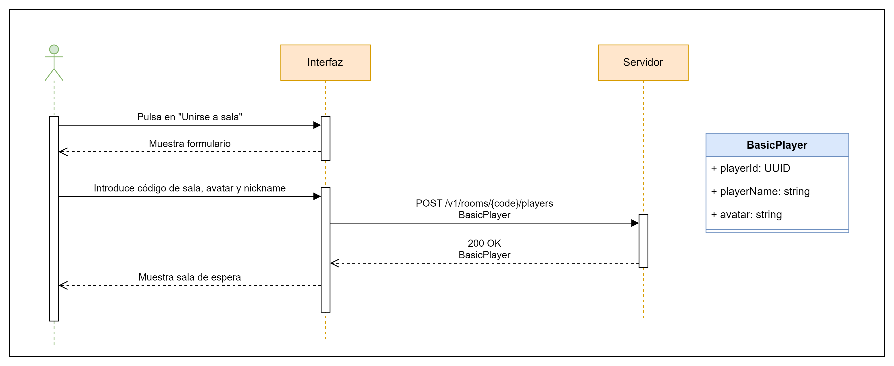
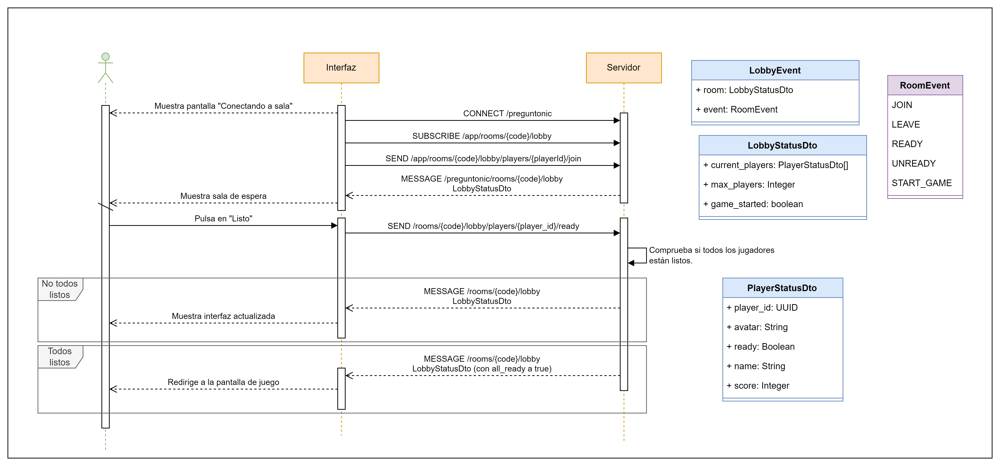
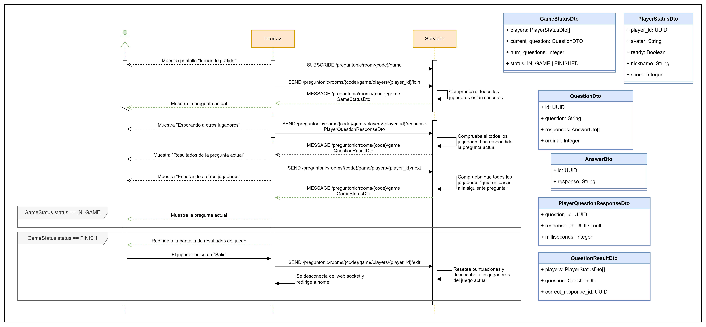

# Arquitectura

## Diagrama de base de datos

## Diagramas de secuencia

### Crear sala (API REST)

### Unirse a sala (API REST)

### Sala de espera (Web Socket)

### Juego y resultados (Web Socket)

