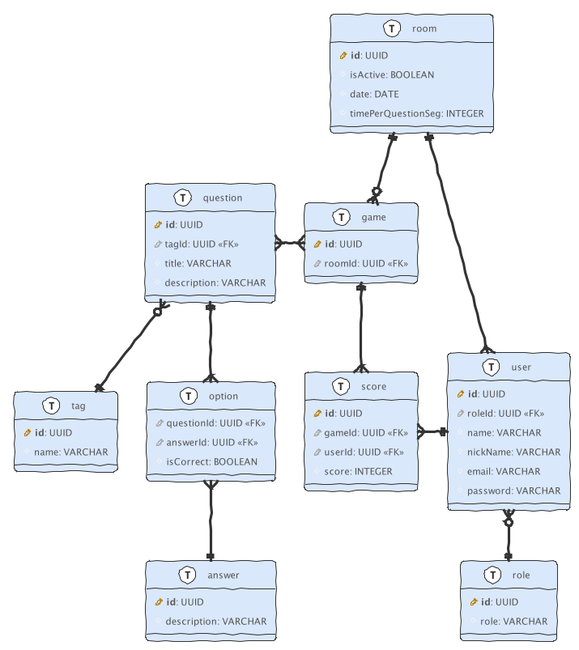
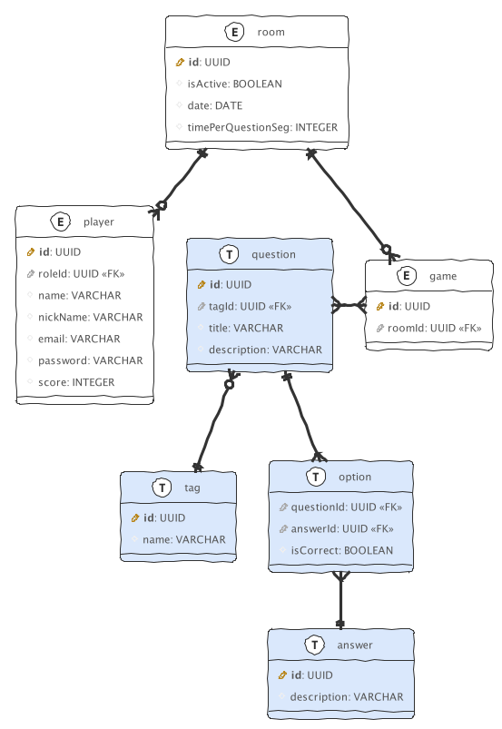

# Diagrama de la base de datos

Inicialmente se planteó un modelo de base de datos relacional con un modelo mas robusto y estructurado, 

pero debido a la naturaleza de los datos y que para el MVP no se requiere una estructura tan compleja, 
se optó por un modelo mas sencillo donde se manejaran algunas tablas como entidades. 

