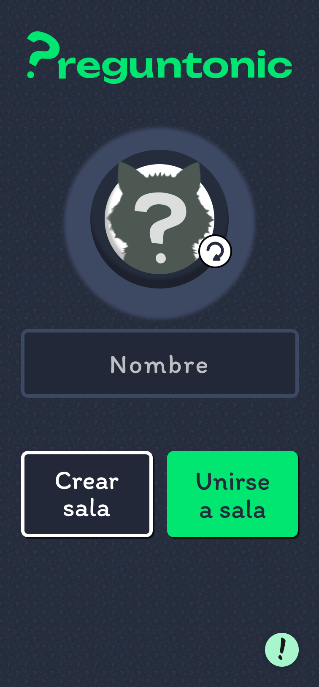
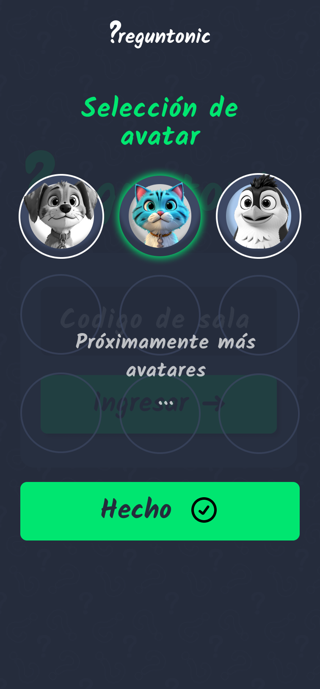
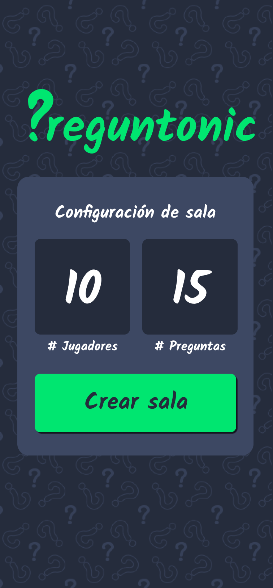
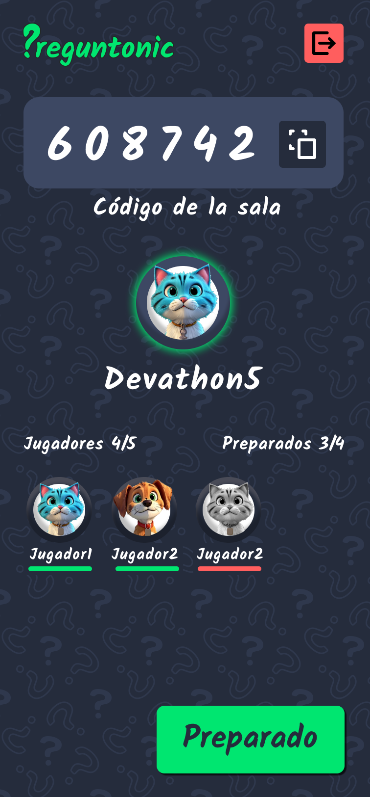
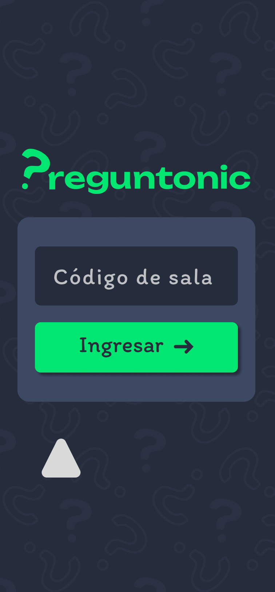
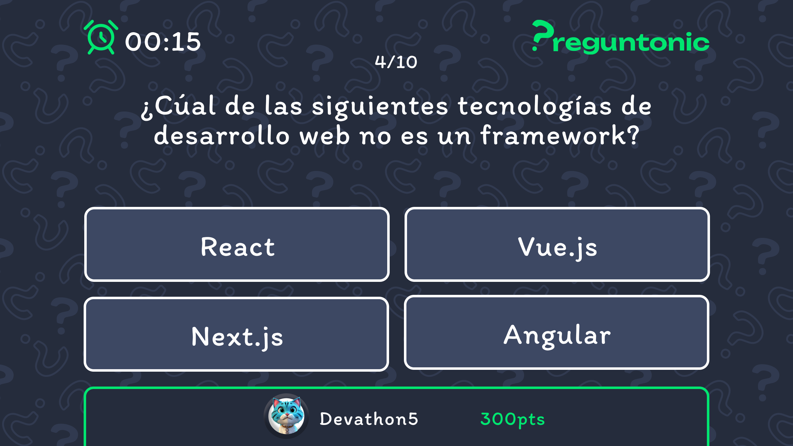
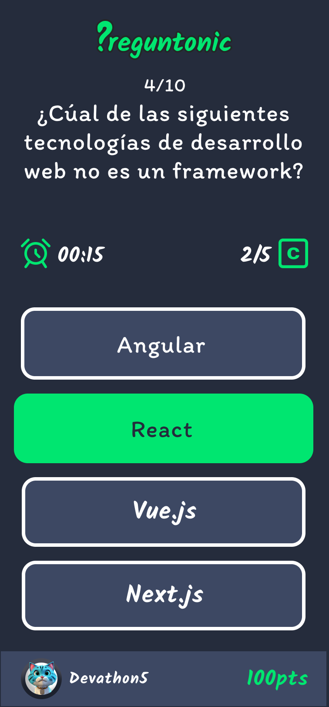
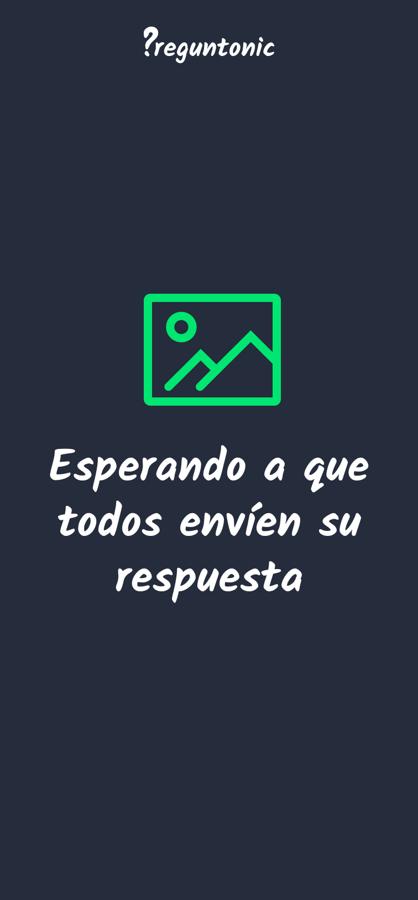
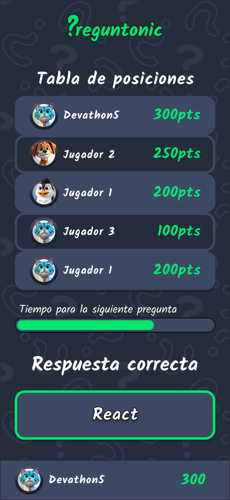
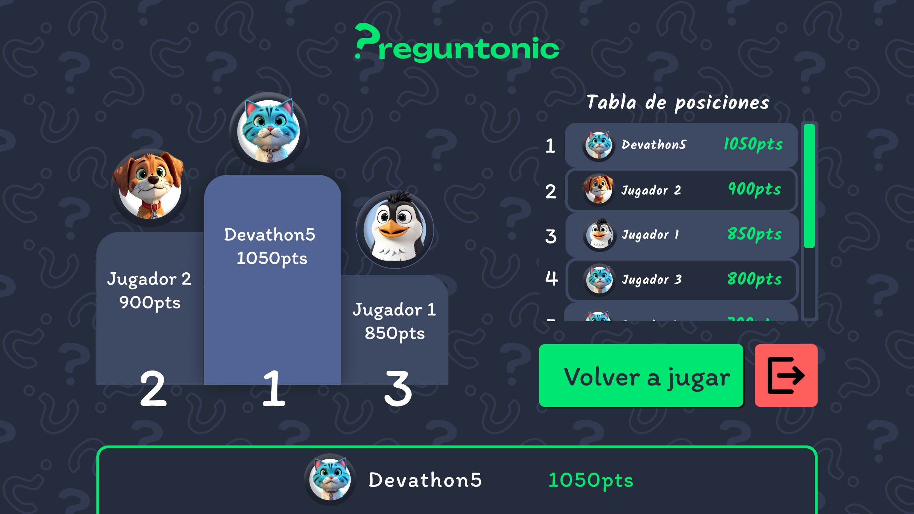

# Preguntonic 

Preguntonic es un juego de preguntas y respuestas que se juega en tiempo real.
Los jugadores compiten entre sí para responder correctamente a las preguntas y ganar puntos.

El juego se desarrolla en rondas, cada una con una pregunta.
Al final de cada ronda, el jugador con más puntos gana.

## Como jugar Preguntonic

[Ve a la pagina oficial](https://preguntonic-backend.onrender.com/v1/rooms) en tu navegador o dispositivo móvil.

### Selección de personaje:
Primero llena tu nombre y selecciona tu personaje favorito

 <---->

### Crea y configuración una sala:
¿Con cuantos amigos quieres jugar? ¿Cuántas preguntas van a responder?

En la configura la sala puedes personalizar tu experiencia de juego, selecciona el número de jugadores y el número de preguntas que responderán.

    

### Unirte a una sala:
¿Ya tienes una sala creada?

copia el código de la sala compartelo con tus amigos para que se unan a la partida.

 ---**608742**--->

   
## Inicia la partida:

Una vez que todos los jugadores se han unido a la sala, y den en "Listos" el juego comenzará automáticamente.

## Partida:

Hora de demostrar tus conocimientos, responde correctamente a las preguntas y gana puntos.

Pero hazlo rápido, el tiempo corre y solo los más rápidos ganarán.

 ------>

## Resultados:

Luego de cada pregunta se mostrará el ranking de los jugadores, y la respuesta correcta a la pregunta.

## Fin de la partida:

Lo has hecho muy bien, pero solo uno puede ser el ganador.
Al final de la partida se mostrará el ranking final y el jugador con más puntos será el ganador.

!Vuelve a jugar! y demuestra que eres el mejor en Preguntonic.